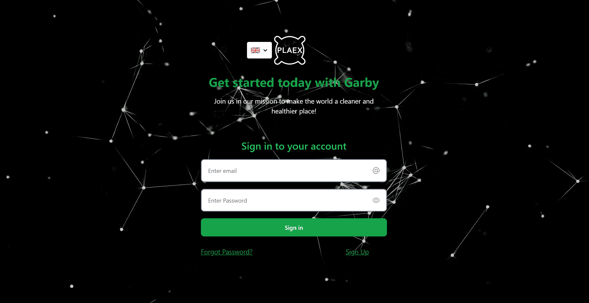
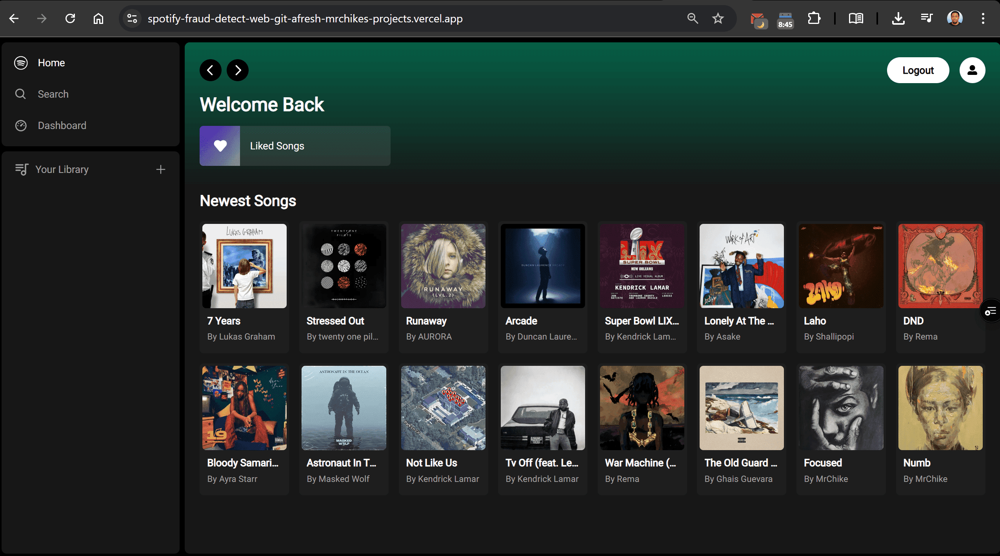
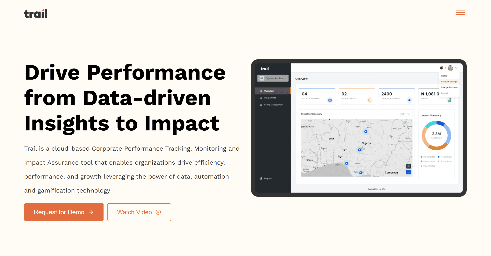

# 💼 Projects

  
🛠️ My Projects

  

    
    
    
    
  

<!-- Modal -->

  &times;

  

    <button id="prevBtn" style="display: none;">&#10094;</button>
    
    <button id="nextBtn" style="display: none;">&#10095;</button>
  

  

    <h2 id="modalTitle"></h2>
    

    

    

  

